# Interação 1 - REDE FABRIC x BESU

## Cenário 01
Dois atores conhecidos e com contas (wallets - decida como chamar você mesmo) nas redes distinas:
1. Alice
2. Bob

Estes atores foram os utilizados por serem os mais comum nas explicações encontradas e pesquisadas na internet para o processo de 
interação entre as duas redes e com a utilização de HTLC - Hashed Timed Lock Contracts.

Voltando para a história, aqui temos a operação em que a Alice, detentora de um título do tesouro nacional com um falor de face de CC$ 500,00 
cconsensus coins armazenado de maneira oficial em uma rede Hyperledger Fabric 2.5 e quer fazer a venda para o BOB por BC$100,00 Bob coins na rede
BESU (EVM).

Os dois atores possuem contas (wallets) nas duas redes destinos, então o que acontecerá:

1. Troca de propriedade (Ownership trade);
2. Alice ofertará ao BOB o seu Título de acordo com as regras (Título de CC$ 500 REDE FABRIC ) por BC$ 100,00 Bob Coins;
3. Bob concorda com o aceite das regras da troca;
3. GWI fará o Lock dos assets e coins nas duas redes;
4. GWI fará receberá as notificações que os Assets e COINS foram lockados nas redes para Alice e Bob;
5. GWI executa a operação de "CLAIM" (Commit) mudando o dono do título e transferindo as Bob Coins para a Alice.


## 1 - Gerar o par de hash para CryptoServices
```bash
./bin/fabric-cli hash --hash_fn=SHA256 secrettext
```
OR
```bash
npm run GWIGenerateSecretHash
```
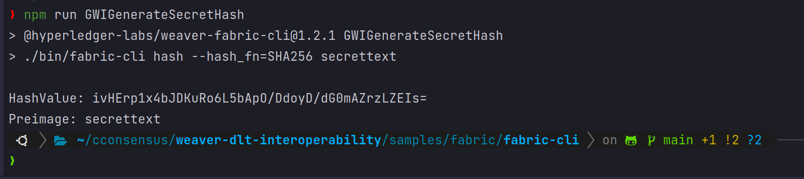

## 2 - Verificar status dos ativos (Não Fungíveis) rede FABRIC (A dona atual é a Alice)
```bash
./scripts/getAssetStatus.sh
```
OR
```bash
npm run GWICheckAssetStatus
```
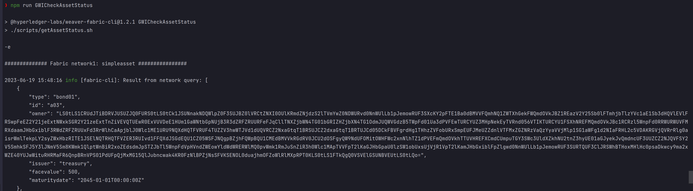

## 3 - Verifica o status dos ativos pertencentes a Alice e Bob na rede Besu network2:
```bash
./bin/besu-cli asset get-balance --network=network2 --account=1
./bin/besu-cli asset get-balance --network=network2 --account=2
```
OR
```bash
npm run GWICheckBalanceBobAccount
npm run GWICheckBalanceAliceAccount
```
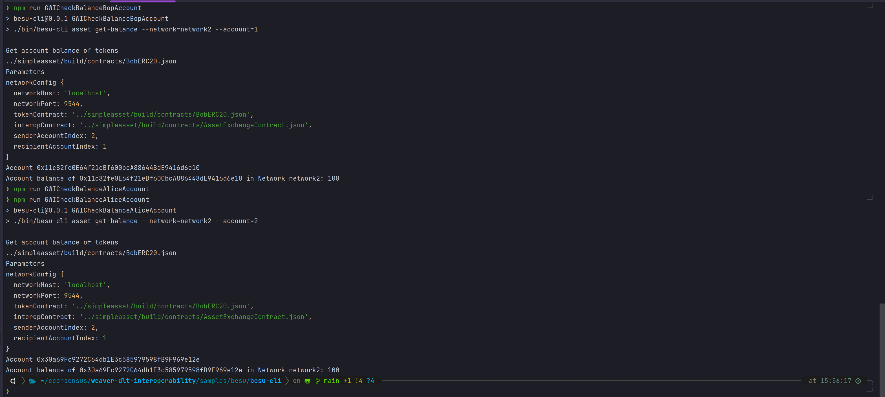

# 4 - GWI executa LOCK Hyperledger Fabric: Alice bloqueio bond01:a03por 60 minutos: bob network1 - Hyperledger Fabric: 
```bash
./bin/fabric-cli asset exchange lock --timeout-duration=3600 --locker=alice --recipient=bob --hashBase64=ivHErp1x4bJDKuRo6L5bApO/DdoyD/dG0mAZrzLZEIs= --target-network=network1 --param=bond01:a03
```
OR
```bash
npm run GWILockAssetAliceToBobHyperledgerFabric
```
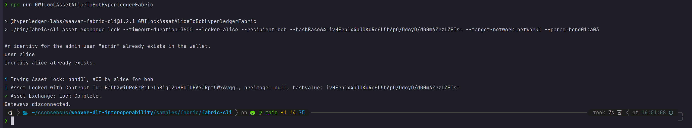


# 5 - GWI Verifica se Lock ocorreu corretamente:
```bash
./bin/fabric-cli asset exchange is-locked --locker=alice --recipient=bob --target-network=network1 --param=bond01:a03
```
OR
```bash
npm run GWIVerifyAliceToBobAssetLockHyperledgerFabric
```
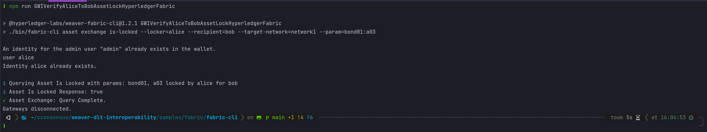

# 6 - GWI executa LOCK Hyperledger Besu: Bob locking 10 unidades de token BobERC20 para Alice na network2 por 30 minutos. 

## Verificar Lock ContractID
```bash
./bin/besu-cli asset lock --network=network2 --sender_account=2 --recipient_account=1 --amount=10 --timeout=1800 --hash_base64=ivHErp1x4bJDKuRo6L5bApO/DdoyD/dG0mAZrzLZEIs=
# Lock contract ID: c25e4df05153832ce95f5ed1028efc9312d6dea7c678d29fbb1990c14ce823bb
```
OR
```bash
npm run GWILockUnitsFromBobToAliceERC20
```
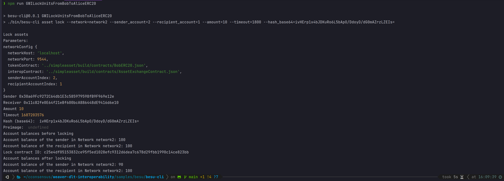


# 7 - GWI Verifica Hyperledger Besu Lock ERC20 BC$ (BobCoins)
```bash
# Lock contract ID: c25e4df05153832ce95f5ed1028efc9312d6dea7c678d29fbb1990c14ce823bb
./bin/besu-cli asset is-locked --network=network2 --lock_contract_id=$LOCKCONTRACTID
```
OR
```bash
npm run GWIVerifyLockBobsAccountContract 
```
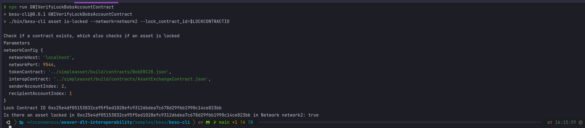

# 8 - GWI Claim Hyperledger Besu - GWI sabendo dos LOCKS nas duas redes, inicia a exchange: Ssolicitação de 10 unidades de BobERC20 tokens bloqueadas por Bob na network2 (Hyperledger Besu):
```bash
./bin/besu-cli asset claim --network=network2 --recipient_account=1 --preimage=secrettext --lock_contract_id=$LOCKCONTRACTID
```
OR
```bash
npm run GWIClaimBobsTokens 
```
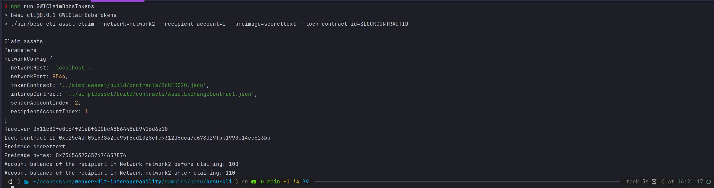

# 9 - GWI Claim Hyperledger Fabric - Reivindicação para BOB de bond01:a03 bloqueado por Alince network1 Hyperledger Fabric:
```bash
./bin/fabric-cli asset exchange claim --recipient=bob --locker=alice --target-network=network1 --param=bond01:a03 --secret=secrettext
```
OR
```bash
npm run GWIClaimAssetOfAliceToBob
```
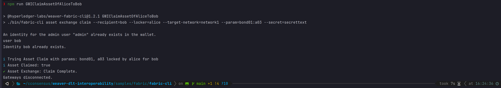

# GWI / Alice / Bob verifica o status dos ativos de títulos pertencentes a Alice e Bob na rede Fabric network1  no diretório /samples/fabric-cli:
```bash
./scripts/getAssetStatus.sh
```
OR
```bash
npm run GWICheckAssetStatus
```
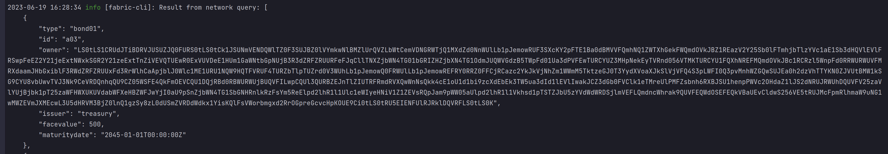

# GWI / Alice / Bob Execute o seguinte em besu-cli, para verificar o status dos ativos pertencentes a Alicee Bob na rede Besu network2:
```bash
./bin/besu-cli asset get-balance --network=network2 --account=1
./bin/besu-cli asset get-balance --network=network2 --account=2
```
OR
```bash
npm run GWICheckBalanceBobAccount
npm run GWICheckBalanceAliceAccount
```
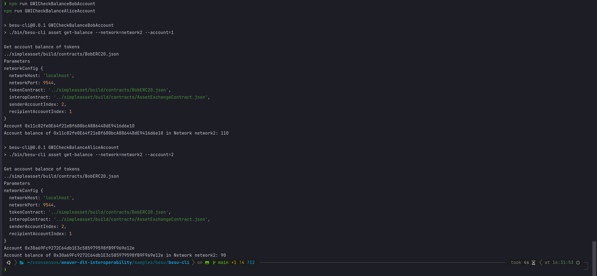
